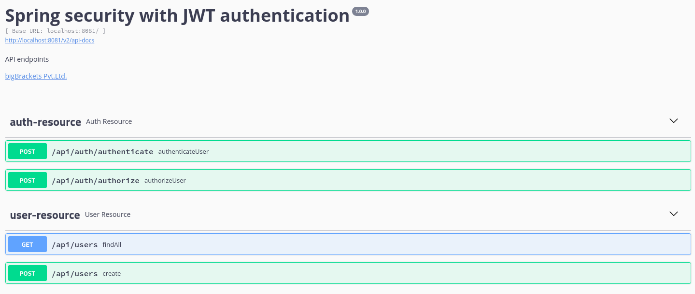
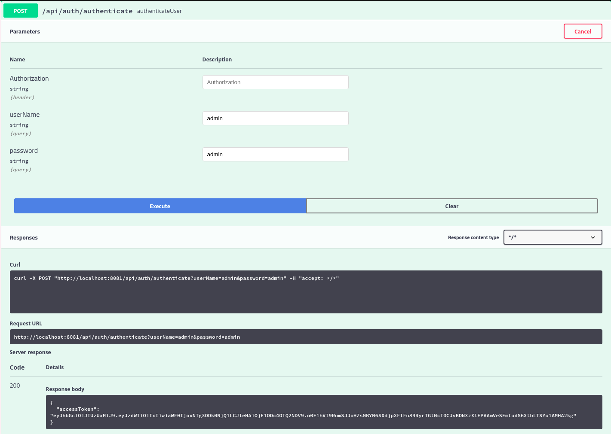
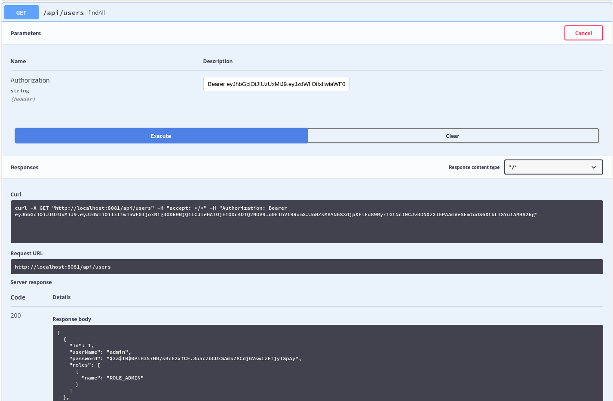

## Spring security with JWT authentication 
This project demonstrates how to integrate jwt authentication in spring boot application. 
Along with this it contains spring profiles (dev and prod), H2 database and swagger for API documentation.
Additionally, you can choose your own database while using in production.

## Prerequisite
* Java 8 or higher
* Maven 
* Docker (optional)
* Heroku (optional)
* IDE 

## Build and Run
* git clone https://github.com/nischalshakya15/spring-security.git

* Go to the project directory.
    
    ``cd spring-security``
    
* Build the project with specific profile. i.e: dev or prod. By default, profile will be dev if not specified.

    ``./mvnw clean install -P{PROFILE_NAME}``
    
* Go to the target directory.
    
    ``cd /target``
    
* Run the project 
    
    ``java -jar spring-security.war``

## Run with docker 
* Build the project using mvn command. 

    ``./mvnw clean install -P{PROFILE_NAME} package``
    
* Build and run the container. 

    ``docker-compose up``
    
## Deploy in Heroku 
* Build the project.
    
    ``./mvnw clean install -P{PROFILE_NAME}``
    
* Add the following dependency in plugins section of pom.xml. 

    ```xml
    <plugin>
      <groupId>com.heroku.sdk</groupId>
      <artifactId>heroku-maven-plugin</artifactId>
      <version>3.0.2</version>
    </plugin>
    ```

* Login into you heroku account.

    ``heroku login``

* Create a Procfile in root directory of your project.

    ``touch Procfile``

* Add the following command in Procfile. 

    ``web: java -jar target/{WAR_FILE_NAME}.war``

* Create an app in heroku.

    ``heroku create --app {APP_NAME}``

* Deploy the war file in heroku. 

    ``./mvnw clean -P{PROFILE_NAME} package heroku:deploy-war`` 

* Open the app. 

    ``heroku open``

* View the app logs.

    ``heroku logs --tail``
             

## Swagger documentation
* Go to the browser

   ``http://localhost:8081/swagger-ui.html``

   


## Using accessToken to access API endpoints. 

* Authenticate the user with **userName admin**  and **password admin**.

* If authentication is successful it will give you an accessToken. 

  

* Using that accessToken we can access the protected end points of **user-resource**.
   
   


## References 
* https://devcenter.heroku.com/articles/deploying-spring-boot-apps-to-heroku
* https://devcenter.heroku.com/articles/deploying-java-applications-with-the-heroku-maven-plugin

**Note: You can also use curl command as shown in Curl section of swagger-ui**
    
